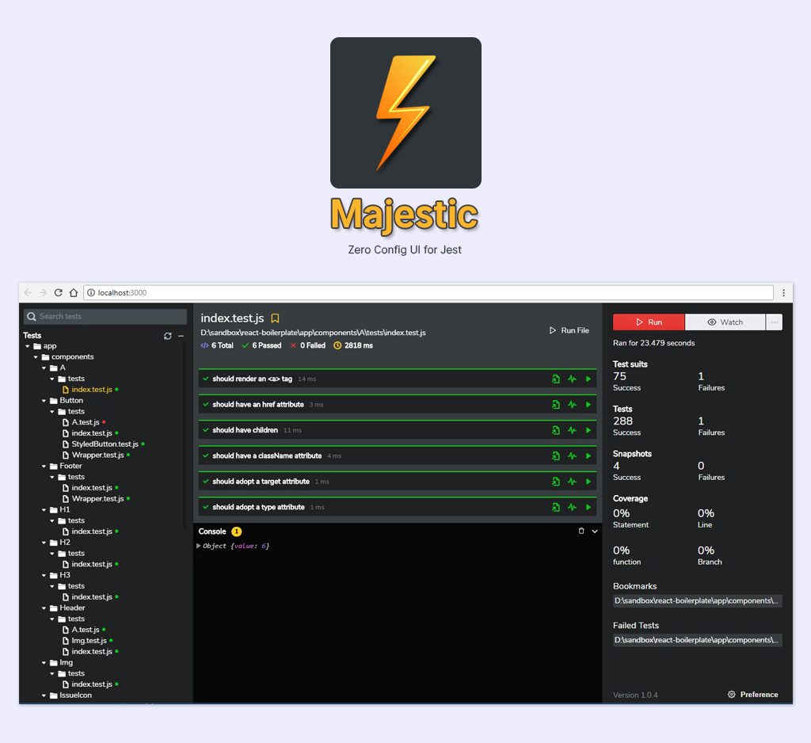

> This is Majestic 1.0, a rewrite from scratch which is still in alpha. Majestic classic is [over here.](https://github.com/Raathigesh/majestic/tree/master)

 

### ⚡ Features

- 🖱 Run tests with a click
- 📸 Selective snapshot update
- 💣 Launch debugger with a click
- 🔍 Search tests
- 🔖 Bookmark tests
- 🐞 Dedicated test failure view
- 📜 Log with `majestic.log()`

 

### 🚀 Getting started

- `npm install majestic@alpha -g` or `yarn global add majestic@alpha`
- Open the terminal and navigate to your project directory
- Run `majestic`

 

### 💻 Contribute

- Clone the repo
- `cd app`
- `yarn install`
- `yarn start` will start the dev server for UI
- `yarn server` will start the node server
- `yarn debug` will start the node server in watch mode

 

### 🌠 Contributors

  <!-- ALL-CONTRIBUTORS-LIST:START - Do not remove or modify this section -->

| [ Raathigeshan](https://twitter.com/Raathigesh) 💻 📖 💬 👀 🤔 🎨 | [ James Adams](https://twitter.com/jamesadams0) 💻 🐛 📖 🤔 | [ Lucas Azzola](https://twitter.com/lucasazzola) 💻 👀 🤔 | [ <b>Napoleon Oikonomou</b>](https://iamnapo.me) [💻](https://github.com/Raathigesh/majestic/commits?author=iamnapo "Code") [📦](https://github.com/caskroom/homebrew-cask/blob/master/Casks/majestic.rb "Packaging/porting to new platform") |
| :--------------------------------------------------------------------------------------------------------------------------------------------------------------------------: | :--------------------------------------------------------------------------------------------------------------------------------------------------------------------: | :------------------------------------------------------------------------------------------------------------------------------------------------------------------: | :-------------------------------------------------------------------------------------------------------------------------------------------------------------------------------------------------------------------------------------------------------------------------------------------------------------------------------------------------: |

<!-- ALL-CONTRIBUTORS-LIST:END -->

This project follows the [all-contributors](https://github.com/kentcdodds/all-contributors) specification.
Contributions of any kind are welcome!

 

### 🔵 License

MIT
