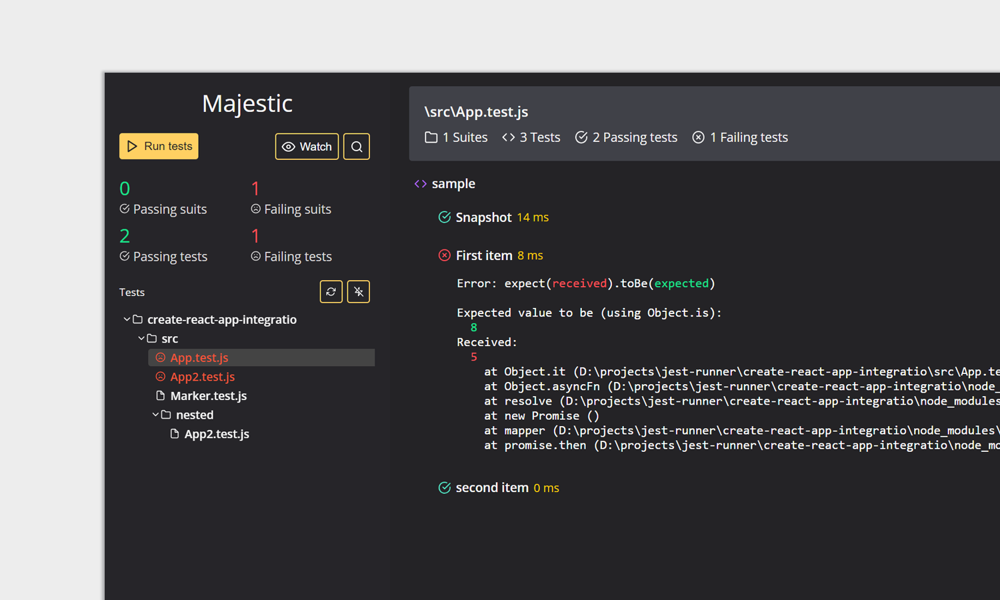

<div  align="center">

<br />
<br />


</div>

<br />

> Still WIP. Not published to npm yet.

Majestic is a GUI for [Jest](https://jestjs.io/)

- ✅ Run all the tests or a single file
- ⏱ Toggle watch mode
- 📸 Update snapshots
- ❌ Examine test failures as they happen
- 🔍 Search tests

### Get started

Run majestic via `npx` in a project directory

```bash
cd ./my-jest-project # go into a project with Jest
npx majestic # execute majestic
```

or install Majestic globally via Yarn and run majestic

```bash
yarn global add majestic # install majestic globally
cd ./my-jest-project # go into a project with Jest
majestic # execute majestic
```

or install Majestic globally via Npm and run majestic

```bash
npm install majestic -g # install majestic globally
cd ./my-jest-project # go into a project with Jest
majestic # execute majestic
```

### Running as app

Running with the `--app` flag will launch Majestic as a chrome app.

### Optional configuration

You can configure Majestic by adding `majestic` key to `package.json`.

```javascript
// package.json
{
    "majestic": {
        // if majestic fails to find the Jest package, you can provide it here
        jestScriptPath: "../node_modules/jest/bin/jest.js",
        // if you want to pass additional arguments to jest, do it here
        args: [],
        // environment variables to pass to the process
        env: {}
    }
}
```

### Contribute

Have a look at the [contribution guide](./CONTRIBUTING.MD).

### License

MIT
