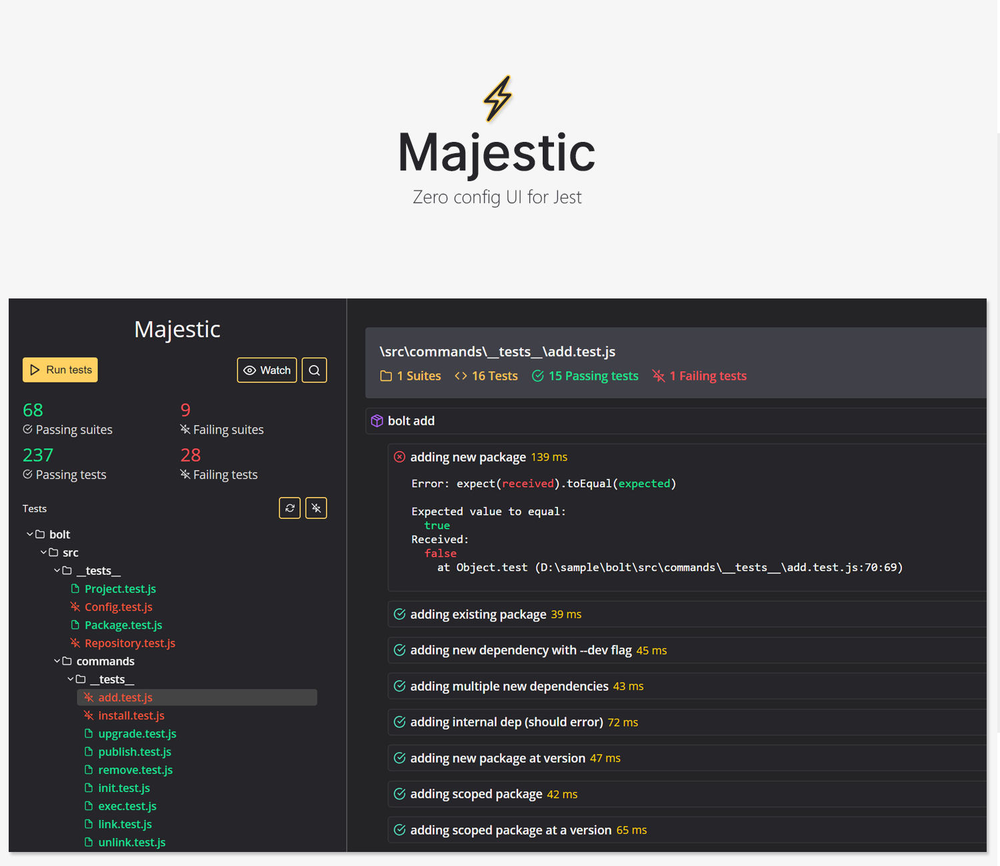

<div  align="center">

<br />
<br />
<a href="https://github.com/Raathigesh/majestic/actions">
  
</a>


<a href="https://spectrum.chat/majestic">
  
</a>
</div>

<br />

Majestic is a GUI for [Jest](https://jestjs.io/)

- ✅ Run all the tests or a single file
- ⏱ Toggle watch mode
- 📸 Update snapshots
- ❌ Examine test failures as they happen
- ⏲ Console.log() to the UI for debugging
- 🚔 Built-in coverage report
- 🔍 Search tests
- 💎 Works with flow and typescript projects
- 📦 Works with Create react app

> Majestic supports Jest 20 and above

### Get started

Run majestic via `npx` in a project directory

```bash
cd ./my-jest-project # go into a project with Jest
npx majestic # execute majestic
```

or install Majestic globally via Yarn and run majestic

```bash
yarn global add majestic # install majestic globally
cd ./my-jest-project # go into a project with Jest
majestic # execute majestic
```

or install Majestic globally via Npm and run majestic

```bash
npm install majestic -g # install majestic globally
cd ./my-jest-project # go into a project with Jest
majestic # execute majestic
```

### Running as an app

Running with the `--app` flag will launch Majestic as a chrome app.

### Optional configuration

You can configure Majestic by adding `majestic` key to `package.json`.

```javascript
// package.json
{
    "majestic": {
        // if majestic fails to find the Jest package, you can provide it here. Should be relative to the package.json
        "jestScriptPath": "../node_modules/jest/bin/jest.js",
        // if you want to pass additional arguments to Jest, do it here
        "args": ['--config=./path/to/config/file/jest.config.js'],
        // environment variables to pass to the process
        "env": {
          "CI": "true"
        }
    }
}
```

#### Optional configuration in project with multiple Jest configuration files

```javascript
{
    "majestic": {
        "jestScriptPath": "../node_modules/jest/bin/jest.js",
        "configs": {
          "config1": {
            "args": [],
            "env": {}
          },
          "config2": {
            "args": [],
            "env": {}
          }
        }
    }
}
```

### Arguments

`--config` - Will use this config from the list supplied in optional configuration.

`--debug` - Will output extra debug info to console. Helps with debugging.

`--noOpen` - Will prevent from automatically opening the UI url in the browser.

`--port` - Will use this port if available, else Majestic will pick another free port.

`--version` - Will print the version of Majestic and will exit.

### Shortcut keys

`alt+t` - run all tests

`alt+enter` - run selected file

`alt+w` - watch

`alt+s` - search

`escape` - close search

### Troubleshooting

Have a look at some of the [common workarounds](./Troubleshooting.md).

### Contribute

Have a look at the [contribution guide](./CONTRIBUTING.MD).

## Contributors

Thanks goes to these wonderful people ([emoji key](https://allcontributors.org/docs/en/emoji-key)):

<!-- ALL-CONTRIBUTORS-LIST:START - Do not remove or modify this section -->
<!-- prettier-ignore-start -->
<!-- markdownlint-disable -->
<table>
  <tr>
    <td align="center"><a href="http://www.duncanbeevers.com"><br /><sub><b>Duncan Beevers</b></sub></a><br /><a href="https://github.com/Raathigesh/majestic/commits?author=duncanbeevers" title="Code">💻</a></td>
    <td align="center"><a href="https://github.com/M4cs"><br /><sub><b>Max Bridgland</b></sub></a><br /><a href="https://github.com/Raathigesh/majestic/commits?author=M4cs" title="Documentation">📖</a> <a href="#ideas-M4cs" title="Ideas, Planning, & Feedback">🤔</a> <a href="https://github.com/Raathigesh/majestic/issues?q=author%3AM4cs" title="Bug reports">🐛</a> <a href="https://github.com/Raathigesh/majestic/commits?author=M4cs" title="Code">💻</a></td>
    <td align="center"><a href="https://github.com/yurm04"><br /><sub><b>Yuraima Estevez</b></sub></a><br /><a href="https://github.com/Raathigesh/majestic/commits?author=yurm04" title="Code">💻</a></td>
    <td align="center"><a href="http://jake.nz"><br /><sub><b>Jake Crosby</b></sub></a><br /><a href="https://github.com/Raathigesh/majestic/commits?author=jake-nz" title="Code">💻</a></td>
    <td align="center"><a href="http://gavinhenderson.me"><br /><sub><b>Gavin Henderson</b></sub></a><br /><a href="https://github.com/Raathigesh/majestic/commits?author=gavinhenderson" title="Code">💻</a></td>
    <td align="center"><a href="https://briwa.github.io"><br /><sub><b>briwa</b></sub></a><br /><a href="https://github.com/Raathigesh/majestic/commits?author=briwa" title="Code">💻</a></td>
    <td align="center"><a href="https://github.com/Luanf"><br /><sub><b>Luan Ferreira</b></sub></a><br /><a href="https://github.com/Raathigesh/majestic/commits?author=Luanf" title="Code">💻</a></td>
  </tr>
  <tr>
    <td align="center"><a href="https://github.com/cse-tushar"><br /><sub><b>Tushar Gupta</b></sub></a><br /><a href="https://github.com/Raathigesh/majestic/commits?author=cse-tushar" title="Code">💻</a></td>
    <td align="center"><a href="https://agu.st/"><br /><sub><b>Agusti Fernandez</b></sub></a><br /><a href="https://github.com/Raathigesh/majestic/commits?author=agustif" title="Code">💻</a> <a href="#ideas-agustif" title="Ideas, Planning, & Feedback">🤔</a></td>
    <td align="center"><a href="http://blog.42at.com"><br /><sub><b>Moos</b></sub></a><br /><a href="https://github.com/Raathigesh/majestic/issues?q=author%3Amoos" title="Bug reports">🐛</a> <a href="https://github.com/Raathigesh/majestic/commits?author=moos" title="Code">💻</a> <a href="https://github.com/Raathigesh/majestic/commits?author=moos" title="Documentation">📖</a></td>
    <td align="center"><a href="http://maciejzelek.space"><br /><sub><b>MacZel</b></sub></a><br /><a href="https://github.com/Raathigesh/majestic/commits?author=MacZel" title="Code">💻</a> <a href="#ideas-MacZel" title="Ideas, Planning, & Feedback">🤔</a></td>
    <td align="center"><a href="https://github.com/krazylegz"><br /><sub><b>Vikram Dighe</b></sub></a><br /><a href="https://github.com/Raathigesh/majestic/commits?author=krazylegz" title="Code">💻</a></td>
    <td align="center"><a href="https://github.com/jsmey"><br /><sub><b>John Smey</b></sub></a><br /><a href="https://github.com/Raathigesh/majestic/commits?author=jsmey" title="Code">💻</a> <a href="#ideas-jsmey" title="Ideas, Planning, & Feedback">🤔</a> <a href="https://github.com/Raathigesh/majestic/issues?q=author%3Ajsmey" title="Bug reports">🐛</a></td>
    <td align="center"><a href="https://github.com/BuckAMayzing"><br /><sub><b>BuckAMayzing</b></sub></a><br /><a href="https://github.com/Raathigesh/majestic/commits?author=BuckAMayzing" title="Code">💻</a> <a href="https://github.com/Raathigesh/majestic/issues?q=author%3ABuckAMayzing" title="Bug reports">🐛</a></td>
  </tr>
  <tr>
    <td align="center"><a href="http://rahulakrishna.github.io"><br /><sub><b>Rahul A. Krishna</b></sub></a><br /><a href="https://github.com/Raathigesh/majestic/commits?author=rahulakrishna" title="Code">💻</a> <a href="#ideas-rahulakrishna" title="Ideas, Planning, & Feedback">🤔</a> <a href="#tool-rahulakrishna" title="Tools">🔧</a></td>
    <td align="center"><a href="https://amilajack.com"><br /><sub><b>Amila Welihinda</b></sub></a><br /><a href="#infra-amilajack" title="Infrastructure (Hosting, Build-Tools, etc)">🚇</a></td>
    <td align="center"><a href="https://github.com/gregveres"><br /><sub><b>gregveres</b></sub></a><br /><a href="https://github.com/Raathigesh/majestic/issues?q=author%3Agregveres" title="Bug reports">🐛</a> <a href="https://github.com/Raathigesh/majestic/commits?author=gregveres" title="Code">💻</a></td>
    <td align="center"><a href="http://adamklein.dev"><br /><sub><b>adam klein</b></sub></a><br /><a href="https://github.com/Raathigesh/majestic/commits?author=adamkleingit" title="Tests">⚠️</a> <a href="https://github.com/Raathigesh/majestic/commits?author=adamkleingit" title="Code">💻</a></td>
    <td align="center"><a href="http://www.raphaelbarbazza.com"><br /><sub><b>Raphaël Barbazza</b></sub></a><br /><a href="https://github.com/Raathigesh/majestic/commits?author=rbarbazz" title="Code">💻</a></td>
    <td align="center"><a href="https://philalsford.com"><br /><sub><b>Phil Alsford</b></sub></a><br /><a href="https://github.com/Raathigesh/majestic/commits?author=philals" title="Documentation">📖</a></td>
  </tr>
</table>

<!-- markdownlint-enable -->
<!-- prettier-ignore-end -->
<!-- ALL-CONTRIBUTORS-LIST:END -->

This project follows the [all-contributors](https://github.com/all-contributors/all-contributors) specification. Contributions of any kind welcome!
