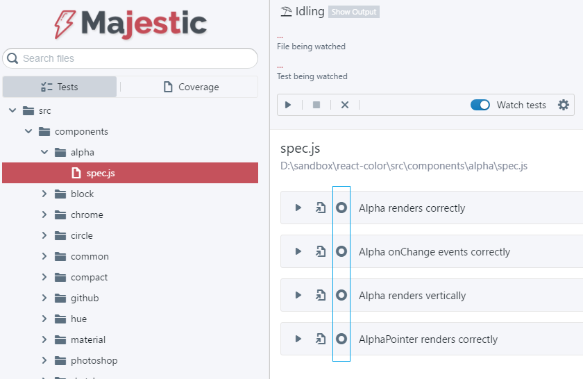

# Majestic

Majestic extension allows you to start debugging from [Majestic app](https://github.com/Raathigesh/majestic).

## How to use it?

* Download the [Majestic app](https://github.com/Raathigesh/majestic)
* Open the project in VS Code and also in Majestic app
* If everything goes fine, there will be debug buttons next to each test
* Click it to debug the test

